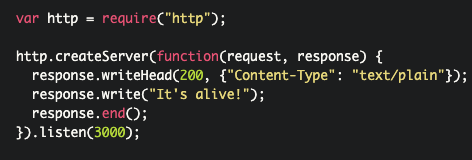
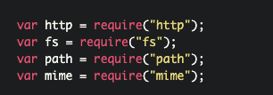
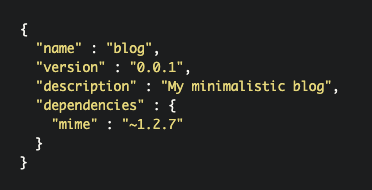
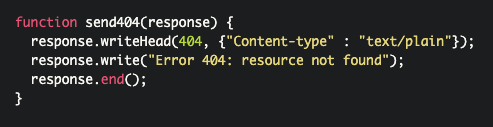
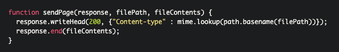
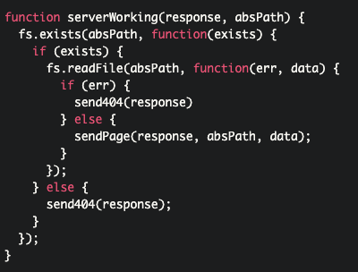
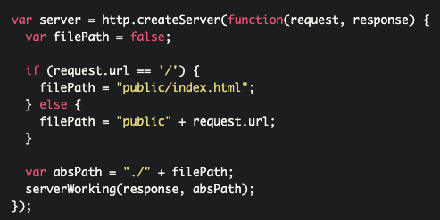
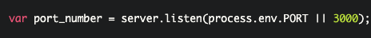
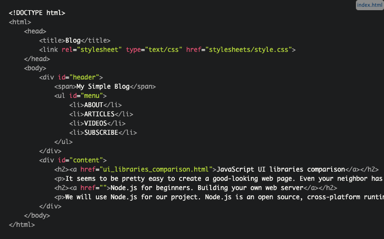

# Read 5 Notes

# [Heroku](https://devcenter.heroku.com/articles/getting-started-with-nodejs)

# [node.js](https://howtonode.org/deploy-blog-to-heroku)
Create a server with node.js

Heroku is a cloud platform as a service (cool long-bearded programmer guys call such type of things "PaaS"). It allows you to deploy your web server, so everyone could see how awesome you are as a web developer

## declare some variables

1. The first one will give you the key to Node's HTTP functionality. 
2. The second one is for possibility to interact with the file system. 
3. The third one allows you to handle file paths. 
4. The last one allows you to determine a file's MIME-type. 

## Create the package.json file and fill it with proper information

We'll use built-in Node Package Manager
run: npm install

## now create send404() function. It will handle the sending of 404 error

## define sendPage() function

## This function will return the content of the requested file or the 404 error otherwise

## create the HTTP server

## Heroku sets a dynamically assigned port number to your app. That's why we need to handle all this mess with ports as it’s shown below

## create the index.html file

## Heroku time

### 1. Open your terminal within your project folder
cd /path/to/my/project
Then run: **git init**

### 2. Empty Git repository will be initialized in .git/ folder.

Then run: **git add .**

### 3. This command allows Git to track your files changes.

Now commit your files to the initialized Git repo: 
**git commit -m "Simple server functionality added"**

### 4. We'll create our first Heroku application now:

**heroku create**

### Heroku will generate a random name for your application. In my case it's enigmatic-citadel-9298. Don't worry. You can change it later.

### 5. deploy our project. Every Heroku app starts with no branches and no code. So, the first time we deploy our project, we need to specify a remote branch to push to: **git push heroku master** 

The application is now deployed. 
### 6. Ensure that at least one instance of the app is running:
**heroku ps:scale web=1**

### 7. choose a proper name for our first creation. I called it myfirstserver: 
**heroku apps:rename myfirstserver**

## 8. You can try it now: 
**heroku open**

### [home](https://misalz.github.io/301-Reading-Notes/readme.md)