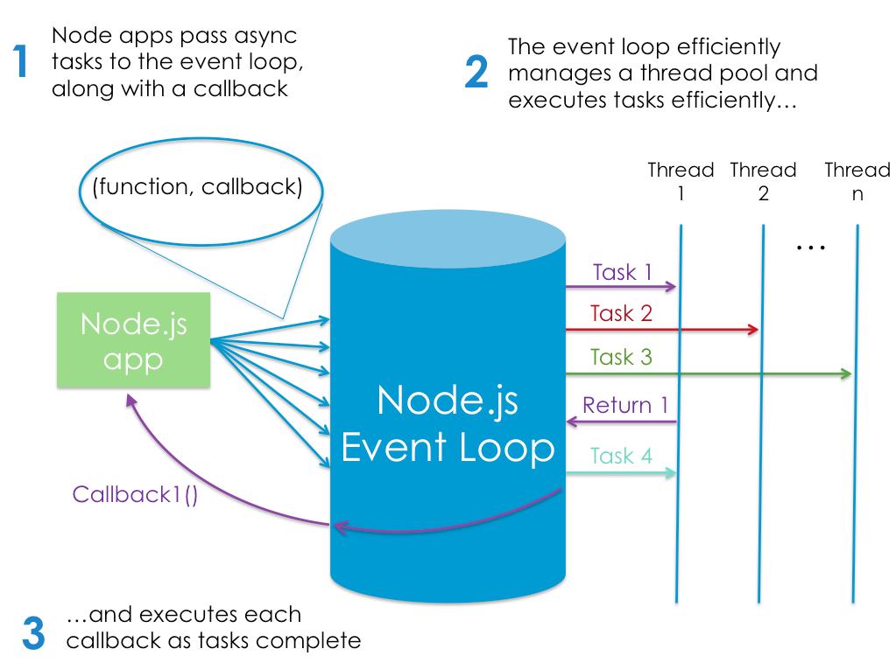

# Read 6 Notes

## (NodeJS)[https://www.sitepoint.com/an-introduction-to-node-js/]
Node.js is a program we can use to execute JavaScript on our computers. In other words, it’s a JavaScript runtime.

version manager =  is a program that allows you to install multiple versions of Node and switch between them at will.

version manager = negates potential permission issues when using Node with npm and lets you set a Node version on a per-project basis.

Node has excellent support for ECMAScript 2015 (ES6) and beyond

**you’re only targeting one runtime (a specific version of the V8 engine), this means that you can write your JavaScript using the latest and most modern syntax**

you’re only targeting one runtime (a specific version of the V8 engine), this means that you can write your JavaScript using the latest and most modern syntax

### Refresher on Linting https://www.sitepoint.com/comparison-javascript-linting-tools/

Node.js Lets Us Run JavaScript on the Server

the server has to wait for the database lookup to complete before it can move on to processing the result. If new requests come in while this is happening, the server will spawn new threads to deal with them. This is potentially inefficient, as a large number of threads can cause a system to become sluggish — and, in the worst case, for the site to go down. The most common way to support more connections is to add more servers.

its event-driven, which means that everything that happens in Node is in reaction to an event. **For example, when a new request comes in (one kind of event) the server will start processing it. If it then encounters a blocking I/O operation, instead of waiting for this to complete, it will register a callback before continuing to process the next event. When the I/O operation has finished (another kind of event), the server will execute the callback and continue working on the original request.**

# Node’s execution model:

### [home](https://misalz.github.io/reading_notes2/)