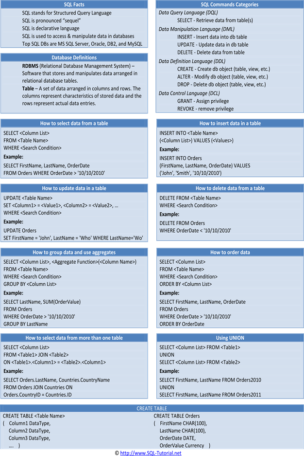

# Read 8 Notes
A primer on SQP **Rahul Batra 2015**

A database is nothing but a collection of organized data.

SQL stands for Structured Query Language

relational database arranges data in a tabular fashion.

Data Definition Language (DDL) : CREATE TABLE, ALTER TABLE, DROP TABLE etc.
These commands allow you to create or modify your database structure.

• Data Manipulation Language (DML) : INSERT, UPDATE, DELETE
These commands are used to manipulate data stored inside your database.
• Data Query Language (DQL) : SELECT
Used for querying or selecting a subset of data from a database.
• Data Control Language (DCL) : GRANT, REVOKE etc.
Used for controlling access to data within a database, commonly used for granting user
privileges.
• Transaction Control Commands : COMMIT, ROLLBACK etc.
Used for managing groups of statements as a unit of work.

----

### [home](https://misalz.github.io/301-Reading-Notes/readme.md)