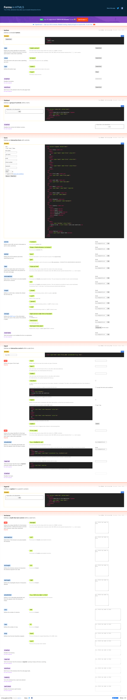

# Read 15 Notes

# Forms Sending

action attribute defines where the data gets sent. ex: <\form action="https://example.com">

The GET method is the method used by the browser to ask the server to send back a given resource: "Hey server, I want to get this resource." In this case, the browser sends an empty body.

The POST method is a little different. It's the method the browser uses to talk to the server when asking for a response that takes into account the data provided in the body of the HTTP request: "Hey server, take a look at this data and send me back an appropriate result."

This attribute lets you specify the value of the Content-Type HTTP header included in the request generated when the form is submitted.

If you want to send files, you need to take three extra steps:

Set the method attribute to POST because file content can't be put inside URL parameters.
Set the value of enctype to multipart/form-data because the data will be split into multiple parts, one for each file plus one for the text data included in the form body (if text is also entered into the form).
Include one or more <\input type="file"> controls to allow your users to select the file(s) that will be uploaded.

### [home](https://misalz.github.io/reading_notes2/)